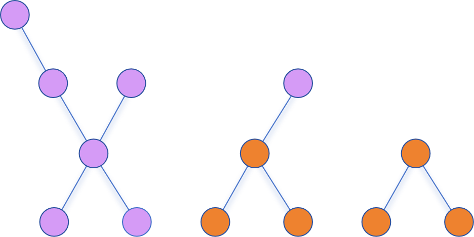
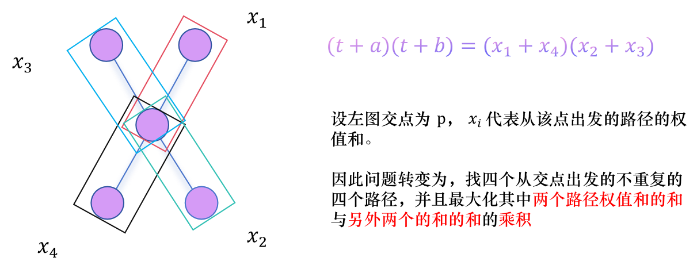

# 初赛解题报告

补题链接: [2025校赛初赛](https://www.luogu.com.cn/training/730327)

## A.π

将给定的100位数存到字符串s里面，判断输入的k是否大于100，如果大于输出sry,idk，否则输出$s[k-1]$

## B.It's Mygo!!!!!

第$i$个人的幸福值$h_i=\sum\limits_{i=1}^na[i][j]·[i\ne j]$，判断有几个小于0的$h_i$即可

时间复杂度$O(n^2)$，因为乐队人数不会很多就让$n$很小好了

## C.小Atom的疑惑

只是为了让大家了解校队成员选拔流程而存在的题，按照输入计算每个$R_i$即可

训练赛的公式为

$R_i =15∗ \frac{n−place+1}n\times\frac{solved}{maxsolved} +5∗ \frac{upsolve}{problemCount}$

校赛的公式为：

$R_i =100∗ \frac{n−place+1}n ∗ \frac{solved}{maxsolved}$

需要注意的是这两个的n分别是和40,50取max

最后需要注意的是小Atom是一个**很厉害**的codeforces蓝名选手，有60分的额外加分

PS：第一个切掉所有小Atom题的小朋友会得到一个Atom玩偶qwq

Fun Fact：Atom本人险些被这道题防了，发生了什么呢？


## D.Faker vs Bin

依据题意可得，最终决赛为前4个战队中实力最强，后4个战队中实力最强的pk，实力高者获胜。

```c++
void solve()
{
    vector<pair<string, int>> v(9);
    for (int i = 1; i < 9; ++i)
        cin >> v[i].first >> v[i].second;
    int f1 = 0, f2 = 0;

    for (int i = 1; i <= 4; ++i)
        if (v[i].second > v[f1].second)
            f1 = i;
    for (int i = 5; i <= 8; ++i)
        if (v[i].second > v[f2].second)
            f2 = i;
    
    if (v[f1].second > v[f2].second)
        cout << v[f1].first << " beats " << v[f2].first << endl;
    else
        cout << v[f2].first << " beats " << v[f1].first << endl;
}
```


## E.移动

只需把每个数的位置记录下来即可，将相差1的数字的间隔累加，跳过间隔最长的两个数。

注意开long long

```c++
for(int i = 1; i < n; i++) {
    int x = abs(P[i + 1] - P[i]);
    sum += x;
    Max = max(Max, x);
}
printf("%lld\n", sum - Max);	
```


## F.小Atom的养鱼缸

题意：有一块由 $n$ 根柱子组成的珊瑚，第 $i$ 根柱子的高度为 $a_{i}$，现在你可以建造一个高度为h的墙包围在珊瑚的最左边和最右边形成一个水箱，接下来你可以往这个水箱中注入最多 $x$ 个单位的水(比墙高的位置不需要注入水)，使得水箱被装满，请问建造的墙的最高高度 $h$ 是多少？

题解：本题其实思想就是找对一个点,使得这个高度的时候水不超过给的 $ x$​ 值,这个点再多一下下,就会超出给的值,所以我们可以采用二分

### 什么是二分答案？

答案在一个区间内，当这个区间很大时，暴力超时。但重要的是——**这个区间是对题目中的某个量有单调性的**，此时，我们就会二分答案。每一次二分会做一次判断，看是否对应的那个量达到/超过了需要的大小。

判断：根据题意写个check函数，如果满足check，就放弃右半区间（或左半区间），如果不满足，就放弃左半区间（或右半区间）。一直往复，直至到最终的答案。

```c++
void solve() {
    int n, x;
    cin >> n >> x;
    vector <ll> a(n);
    for (int i = 0; i < n; ++i) {
        cin >> a[i];
    }
    ll l = 0, r = 1ll << 60;
    while (r - l > 1) {
        ll m = l + r >> 1;
        ll tot = 0;
        for (int i = 0; i < n; ++i) {
            if (a[i] < m) {
                tot += m - a[i];
                if (tot >= x + 2) {
                    tot = x + 2;
                }
            }
        }
        if (tot <= x) {
            l = m;
        } else {
            r = m;
        }
    }
    cout << l << '\n';
}
```


另外提供一种不需要二分的做法，先按$a_i$排序，然后找到最大的i使得$h\ge a_i$，具体做法见代码

```c++
int wk(){
    sort(a+1,a+n+1);
    int now = 0;
    for(int i = 1;i <= n; ++i){
        if(now + (i-1) * (a[i] - a[i-1]) <= m){
            now += (i-1) * (a[i] - a[i-1]);//这是高度达到h所需再添加的水量
        }
        else{
            return (m - now) / (i-1) + a[i-1]; //否则将剩余水量/i-1向下取整即可，i-1是高度低于ai的水柱数量
        }
    }
    return a[n] + (m - now) / n; //同理
}
```


## G.**結束バンド(結束乐队)**

题意：

你是来亲手结束这个乐队的，M团共有$n$个人($n\le 1000$)，每个人都可以被收买，被收买的代价估算为$c_i$。M团的队员之间有$m$对朋友关系，第i对朋友为$x_i,y_i$，如果他们两人间有一人已被收买，那么只需要花费$z_i$的代价即可收买另一人。收买$n$个乐队成员才可使得乐队解散。你想知道亲手结束这个乐队需要花费的最小代价是多少。


题解：

是一个很庞大的乐队（

把它抽象成一张图，每个节点是一个乐队成员

首先再额外新建一个节点，表示~~soyorin~~要结束乐队的你，你向每个成员连一条边权为$c_i$的无向边，容易发现可以视为你与所有人存在友谊关系$(你,i,c_i)$

另外，对于一组友谊关系$(x_i,y_i,z_i)$，在$x_i$和$y_i$之间连一条边权为$z_i$的无向边

设$V$表示被收买成员的集合，$V'$表示没被收买的成员的集合

$V$初始只有额外新建的那个节点（soyorin），$V'$则为其余的n个乐队成员的集合

每次在所有边集里找到一端位于V，一端位于$V'$的边中边权最小的边$(x,y,z)$，将边权加到答案中，同时在$V'$中的端点（y）放到V中，表示使用该友谊关系完成了对y的收买。

重复该过程$n$次，输出答案，时间复杂度$O(nm)$

如果时间限制是寻常的，这样看起来就过去了，但是出题人在比赛前一天写题解的时候发现了这件事，所以时间限制就变得不寻常了（但实测能过6个点

该怎么办呢？学一下Prim算法或者Dijkstra算法你就会了

每次查询后更新一下dis数组即可（dis数组是$V'$中每个点到V的最短的、直接相连的路径，如果不存在则为inf

时间复杂度$O(n^2)$


## H.量子态

根据期望的线性性，所有骰子点数和的期望，就是所有骰子点数期望的和，根据题意分别计算每个骰子的坍缩至各个点数的概率再求期望，最后相加即可

时间复杂度$O(nm)$

```c++
   for (int i = 1; i <= m; ++i) {
        for (int j = 1; j <= n; ++j) {
            double x;
            cin >> x;
            ans += x * x * j;
        }
    }
```


## I.小Atom与奶龙

思路：发现每一行之间修建的代价都互不影响。如果我们算出了每一行的代价，剩下的就是跑一遍前缀和，然后找到代价最小的区间和。因此，问题转化为：给定一行 $m$ 个数，如何修建支架使得满足条件的同时代价最小。

显然这是一个动态规划问题。假设在位置 $i$ 修建支架，则区间 $[i - d + 1,i - 1]$ 内必须至少存在一个支架，定义状态 dp[i] 为位置i修建支架且前 $i$ 个位置满足条件的最小代价，故状态转移方程为：$dp[i] = min_{j ∈ [i-d-1, i-1]} dp[j] + cost_i$

在区间 $[i - d + 1,i - 1]$ 寻找最小的 $dp[j]$，则有很多的实现方式，双set，优先队列，双向队列...

这里提供双向队列的代码

```c++
void solve(){
    int n,m,k,d;
    cin>>n>>m>>k>>d;
    int a[n+2][m+2];
    for(int i=1;i<=n;i++){
        for(int j=1;j<=m;j++){
            cin>>a[i][j];
        }
    }
    vector<int>ans;
    for(int i=1;i<=n;i++){
        deque<int>Q;//记录的是序号下标
        int dp[m+2];
        dp[1]=1;
        Q.push_back(1);
        for(int j=2;j<=m;j++){
            if(!Q.empty()&&j-Q.front()-1>d) Q.pop_front();//间距超出范围，出列
            dp[j]=dp[Q.front()]+a[i][j]+1;
            while(!Q.empty()&&dp[Q.back()]>dp[j]) Q.pop_back();//后面的比新来的j的成本还要更大，这些数直接不要了
            Q.push_back(j);//新来的j入队
        }
        ans.push_back(dp[m]);
    }
    int pre[n+2];
    pre[0]=ans[0];
    for(int i=1;i<ans.size();i++){
        pre[i]=pre[i-1]+ans[i];
    }
    int aans=pre[k-1];
    for(int i=k;i<ans.size();i++){
        aans=min(aans,pre[i]-pre[i-k]);
    }
    cout<<aans<<endl;
}
```


## J.X

根据定义，X 本质上有如下几种情况：




同时可以看出 $f(X) = (t+a)\times (t+b)$，进一步，我们有，**注意以下举例用的是最平凡的情况** ：



简单讨论一下，假设我们找到最优的 $x_1,x_2,x_3,x_4$，设 $Mx_4$ 为 $x_i$ 中最大的4个值所组成的集合，$Mi_4$ 为最小的4个值组成的集合。

如果：

* $x_1 + x_4 > 0$，那么说明 $x_2+x_3$ 越大越好，容易推导出此时必有 $\set{x_1,x_2,x_3,x_4} = Mx_4$
* $x_1 + x_4 < 0$，说明 $x_2 + x_3$ 越小越好，同理有$\set{x_1,x_2,x_3,x_4} = Mi_4$

换句话说，本题就是维护每个点的 $x_i$ 的 **最大4个** 的值和 **最小4个** 的值，然后即可计算出最大的 $f(X)$，当你知道这4个数字可能是哪些数字后，你可以暴力分配它们的取值然后取最大值。

而这其实是 **树的直径DP解法** 的扩展，因此也是经典题。

值得注意的是一般的最优解的情况中，不一定是完整的 $X$ ，具体形状可以参考第一张图的第2，3种图形，你也可以参考当树退化成一条链的情况。

时间复杂度：$O(n)$ 或者 $O(n\log n)$

代码：

```c++
#include <bits/stdc++.h>
#define rep(i,a,b) for(int i = a; i <= b; i++)
#define dwn(i,a,b) for(int i = a; i >= b; i--)
#define MAXN 202501
#define int long long
#define inf 99999999
using namespace std;
typedef long long ll;
inline int read(){
    int x = 0, f = 1;
    char ch = getchar();
    while(ch > '9' || ch < '0'){if(ch == '-') f = -1; ch = getchar();}
    while('0' <= ch && ch <= '9') x = (x << 1) + (x << 3) + ch - '0', ch = getchar();
    return x * f;
}
int n;
vector<int> v[MAXN];
int a[MAXN],mx[MAXN][4],mn[MAXN][4]; // max,min
void ade(int x,int y){
    v[x].push_back(y);
    v[y].push_back(x);
}
void getmax(int *x,int y){
    if(x[3] < y) x[3] = y;
    dwn(i,2,0) if(x[i] < x[i+1]) swap(x[i],x[i+1]);
}
void getmin(int *x,int y){
    if(x[3] > y) x[3] = y;
    dwn(i,2,0) if(x[i] > x[i+1]) swap(x[i],x[i+1]);
}
void dfs1(int x,int y){
    rep(i,0,3) mx[x][i] = -inf, mn[x][i] = inf;
    for(auto u : v[x]){
        if(u == y) continue;
        dfs1(u,x);
        getmax(mx[x],max(mx[u][0],a[u]) + a[x]);
        getmin(mn[x],min(mn[u][0],a[u]) + a[x]);
    }
}
int ans;
void calc(int x){
    if(v[x].size() < 2 || mx[x][1] == -inf || mn[x][1] == inf) return ;
    ans = max(ans, (a[x] + mx[x][0]) * (a[x] + mx[x][1]));
    ans = max(ans, (a[x] + mn[x][0]) * (a[x] + mn[x][1]));
    if(v[x].size() == 2 || mx[x][2] == -inf || mn[x][2] == inf) return ;
    ans = max(ans, (a[x] + mx[x][0]) * (mx[x][1] + mx[x][2]));
    ans = max(ans, (a[x] + mn[x][0]) * (mn[x][1] + mn[x][2]));
    if(v[x].size() == 3 || mx[x][3] == -inf || mn[x][3] == inf) return;
    ans = max(ans, (mx[x][0] + mx[x][3]) * (mx[x][1] + mx[x][2]));
    ans = max(ans, (mn[x][0] + mn[x][3]) * (mn[x][1] + mn[x][2]));
}

void dfs2(int x,int y,int maxx,int minn){
    int Mx[4], Mn[4];
    rep(i,0,3) Mx[i] = mx[x][i],  Mn[i] = mn[x][i];
    if(y) getmax(mx[x],maxx + a[x]), getmin(mn[x],minn + a[x]);
    calc(x);
    for(auto u : v[x]){
        if(u == y) continue;
        int t1 = mx[x][0], t2 = mn[x][0];
        if(t1 == max(mx[u][0],a[u]) + a[x]) t1 = mx[x][1];
        if(t2 == min(mn[u][0],a[u]) + a[x]) t2 = mn[x][1];
        t1 = max(t1, a[x]); t2 = min(t2, a[x]);
        dfs2(u,x,t1,t2);
    }
    rep(i,0,3) mx[x][i] = Mx[i], mn[x][i] = Mn[i];
}
signed main(){
    ans = -inf;
    n = read();
    rep(i,1,n-1){
        int x = read(), y = read();
        ade(x,y);
    }
    rep(i,1,n) a[i] = read();
    dfs1(1,0);
    dfs2(1,0,0,0);
    cout << ans;
    return 0;
}
```