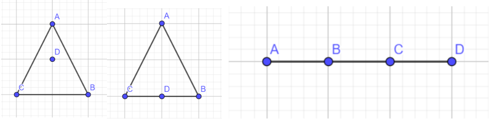

# 决赛解题报告

补题链接: [2025校赛决赛](https://www.luogu.com.cn/training/735119)

## A.小atom的捉迷藏

考虑这n个人，在能被两个位置(1，3，5)看到的人会被算2次。那么人数最少为所有人都不在会在能被两个人看见的位置（2，4，6）上，那么就是 $n$ 个人。最多的情况就是每个人都在能被两个位置看到的人的位置（1，3，5）上，那么每个人会被算两次，就是 $2n$。只要 $a+b+c$ 在这个范围内就有解。

```C++
void solve() {
    int n, a, b, c;
    cin >> n >> a >> b >> c;
    if (a + b + c < n || a + b + c > n * 2) {
        cout << "No\n";
    } else {
        cout << "Yes\n";
    }
}

```


## B.校门外的树

### 思路：

可以用贪心做的。
想要种树种得少，就要一棵树在多个区间同时出现。
所以，在重叠部分种尽可能多的树即可。
然而重叠部分一定在区间的尾部。
所以先对区间按结束位置由小到大进行排序，然后依次在区间的尾部从前往后种树直到满足要求，对于下一个区间，看看差多少树，就在结尾补多少。

于是贪心的思想就很容易出来了：

1. 按结束位置排序
2. 对每个区间一次处理
   1. 从前往后扫描区间，统计已有的树的个数
   2. 若已选点超过要求个数，则continue
   3. 否则从后往前，添加缺少的覆盖点
3. 输出ans

### 程序：

```cpp
#include<bits/stdc++.h>
using namespace std;
struct line{int s,e,v;}a[5005];
int n,m,ans=0;
bool used[30005]={0};//判断是否已经有点
bool cmp(line a,line b)
{
    return a.e<b.e;
}
int main()
{
    scanf("%d%d",&n,&m);
    for(int i=1;i<=m;i++) scanf("%d%d%d",&a[i].s,&a[i].e,&a[i].v);
    sort(a+1,a+1+m,cmp);//排序
    for(int i=1;i<=m;i++)
    {
        int k=0;//用来统计区间已有的树的个数
        for(int j=a[i].s;j<=a[i].e;j++) if(used[j]) k++;//统计已有点的个数
        if(k>=a[i].v) continue;//已满足，continue
        for(int j=a[i].e;j>=a[i].s;j--)//不满足，在结尾处加入
        {
            if(!used[j])
            {
                used[j]=1;
                k++;
                ans++;//答案+1
                if(k==a[i].v) break;//满足退出
            }
        }
    }
    printf("%d",ans);//输出答案
    return 0;
}
```


## C.众数

此题空间范围极小，甚至不能把所有数字储存下来，需要一边输入一边找出答案。

注意到此题众数的数量超过其他数出现数量之和。所以可以记录当前待定的众数和它比其他数多出现的次数。每新输入一个数时，比较它与之前的数字，相同则让次数加一，不同则减一。若次数降为零，则更改待定的众数。容易发现最后的结果一定是众数。

或许一些随机性质的做法也能过，可以尝试把序列分成小段分别求众数，这里不进行展开。

```c++
int x,sum=0,ans=-1;
for(i : 1 to n){
    cin >> x;
    if(sum == 0) ans = x, ++sum;
    else if(ans == x) ++sum;
    else --sum;
}
```


## D.矩阵填充

假设可以填充，那么对于最后一次操作，一定是整行（列）都相同，且之前的操作对该行（列）没有任何影响，因此我们可以直接移除该行（列），剩余的矩阵就变成了完全相同的问题，依此类推，直到整个矩阵都被移除，那么答案就为Yes。

因此我们只需每次寻找完全相同的一行（列），然后移除，直到整个矩阵都被移除，答案为Yes，或者任意一行（列）都不完全相同，答案为No。


## E.纽带乐队（結束バンド）

考察了搜索算法（dfs/bfs）

先使用二重循环枚举每个二人组，然后通过搜索找到钦定这两个人被选取后，其他必选成员的集合，如果这些必选成员之间位置两两不同就说明这个二人组可以被选取，ans++

不加剪枝的搜索理论上是$O(n^2m)$，虽然由于是随机数据的缘故可能跑的也很快（

但是剪枝是显然的，因为那个必选成员的集合大小最大为5，如果大于5一定存在一对位置相同的乐队人，当集合大小大于5就退出即可

所以时间复杂度降至$O(n^2)$


## F.调酒

这题考察了组合计数中的插板法。枚举i，计算将i份材料混合的方案数，与后n-i份材料任意选择的方案数相乘。将i份材料混合的方案数为$C_{i+m-1}^{m-1}-m$。

注意全是同一种材料不能记录，特殊考虑i等于0，即没有进行混合的情况

时间复杂度$O(n)$，标程是$O(n\log n)$的但是快速幂的部分可预处理，组合数也可预处理

```c++
int ans = ksm(m,n); //即m的n次方
for(i : 1 to n){
    int res = (C(i-1+m,m-1) - m) * ksm(m,n-i) % mod;
    ans = (ans + res) % mod;
}
```


## G.组合GCD

使用 $F$ 代表斐波那契数列。

由组合数结论 $F_{x + 1} = \sum_{i = 0}^{\lfloor \frac{x}{2} \rfloor} C_{x - i}^i$，因此实际上计算的是：

$$
\mathrm{gcd}(F_{x+1},F_{y+1})\;\mathrm{mod}\;1e9+7
$$

由于 $gcd(F_x,F_y) = F_{gcd(x, y)}$，因此求的是 $F_{gcd(x+1,y+1)} \; \mathrm{mod} \; 1e9 + 7$，那么实际上本题就是求斐波那契数列的。


方法有很多，例如根据递推式+矩阵快速幂，还可以尝试利用结论($n \geq 1$)，进行倍增:

$$
\begin{cases} 
F_{2n} = F_n (2F_{n + 1} - F_n)\\\\
F_{2n+1} = F_n^2 + F_{n+1}^2
\end{cases}
$$

$O(\log M)$，$M$ 为$x+1,y+1$ 的值域


## H.图

考虑将所有边定向，将无向边改成由度数小的点向度数大的点连的有向边。这样，由于度数大于$\sqrt m$的点不超过 $\sqrt m$ 个，因此，每个点的出度都不超过 $\sqrt m$。

对于每个点u，记 $f_u$ 表示所有指向它的边的对应的点权和。

记当前答案为 ans 。

对于每次操作，将 $a_u$ 修改为 x，ans的变化量即为$(x-a_u)(f_u+\sum_{(u,v)\in E}a_v)$ ，再修改对应的 $f_v$即可。

由于任意点的出度不超过$\sqrt m$，因此单次操作复杂度为 $\sqrt m $。

总时间复杂度为 $O(n+q\sqrt m)$。


## I.直角坐标系

> 数据不强，二分+树状数组小常数的做法没有卡，估计比赛时大部分 $n\log^2n$ 的做法也能过，这题其实应该定位稍微基础的树状数组题，原本想出主席树来着。

设坐标轴中心 $P(a,b)$

首先暴力枚举 $P$ 的 $b$，正常来说它的取值范围应该为整个实数范畴，但是可以看到因为题目设计**将 $y \geq b$ 的范围都包括在第1和2象限中**，因此仅仅枚举所有点的纵坐标作为 $b$ 的取值，并且满足1,2象限分别至少有 1 个点，即可包含所有的合法情况。

首先，从小到大枚举 $b$ 的 取值，对于某个固定的取值，首先找到 $a\in [x_1, x_2]$ 使得此时 **第一象限点数=第二象限点数** ，这是简单的，树状数组可以以 $\log n$ 的时间复杂度倍增找到第一个满足前缀和大于等于 $k$ 的下标，这里也没有卡小常数的 $\log^2 n$。

接着，当 $a\in [x_1, x_2]$ 使得第 3 象限点数 * 第 4 象限点数最大，这是一个二次函数，且在两边点数一致时附近取最大，因此，找到3 象限点数 * 第 4 象限点数相等的位置即可，然后把它附近的符合要求的 $a$ 也算一遍，这样就能算出一个此时的最大值。

时间复杂度：$O(n\log n )$，$O(n \log^2 n)$ 做法能通过是因为我实在不知道怎么卡。

```c++
#include <bits/stdc++.h>
using namespace std;
typedef long long ll;

struct Fenw {
    int n;
    vector<int> f;
    Fenw(int n): n(n), f(n+1, 0) {}
    void update(int i, int delta) {
        for(; i <= n; i += i & -i)
            f[i] += delta;
    }
    int query(int i) {
        int s = 0;
        for(; i; i -= i & -i)
            s += f[i];
        return s;
    }
    int kth(int k) {
        int idx = 0, bit = 1 << 20; 
        for(; bit; bit >>= 1) {
            int next = idx + bit;
            if(next <= n && f[next] < k) {
                k -= f[next];
                idx = next;
            }
        }
        return idx + 1;
    }
};

struct Point {
    int x, y;
};

ll calcProduct(Fenw &fenwL, int m, int a) {
    int leftCount = fenwL.query(a - 1);
    int total = fenwL.query(m);
    return (ll)leftCount * (total - leftCount);
}

void sol() {
    int n;
    cin >> n;
    vector<Point> pts(n);
    vector<int> xs;
    for (int i = 0; i < n; i++){
        cin >> pts[i].x >> pts[i].y;
        xs.push_back(pts[i].x);
    }
    sort(xs.begin(), xs.end());
    xs.erase(unique(xs.begin(), xs.end()), xs.end());
    auto getIdx = [&](int x) -> int {
        return int(lower_bound(xs.begin(), xs.end(), x) - xs.begin()) + 1;
    };
    for (int i = 0; i < n; i++){
        pts[i].x = getIdx(pts[i].x);
    }
    
    sort(pts.begin(), pts.end(), [](const Point &a, const Point &b){
        return a.y > b.y;
    });
    
    int m = xs.size();
    Fenw fenwU(m), fenwL(m);
    for (int i = 0; i < n; i++){
        fenwL.update(pts[i].x, 1);
    }
    ll ans = 0;
    int idx = 0; 
    ll d = 0;
    while(idx < n){
        int curY = pts[idx].y;
        while(idx < n && pts[idx].y == curY){
            fenwU.update(pts[idx].x, 1);
            fenwL.update(pts[idx].x, -1);
            idx++;
        }
        
        int cntU = fenwU.query(m);
        if(cntU >= 2 && cntU % 2 == 0) {
            int half = cntU / 2;
            int x_left = fenwU.kth(half);    
            int x_right = fenwU.kth(half + 1);  
            
            if(x_left < x_right) {
                int lb = x_left + 1, rb = x_right;
                ans = max(ans, calcProduct(fenwL, m, rb));
                ans = max(ans, calcProduct(fenwL, m, lb));
                int x1 = fenwL.kth((n - cntU) / 2);
                for (auto x : {x1 - 1, x1, x1 + 1})
                    if (x >= lb && x <= rb) 
                        ans = max(ans, calcProduct(fenwL, m, x));
            }

        }
    }
    
    cout << ans << "\n";
}

int main(){
    cin.tie(0) -> sync_with_stdio(0);
    int t;cin >> t;
    while (t -- ) 
        sol();
    
    return 0;
}
```


## J.小Atom的集合

是最后一道小Atom题（

25pts：

直接暴力枚举子集，然后暴力求一下max和min就好，时间复杂度$O(2^n)或O(2^nn)$

50pts：

先将a数组从小到大排序，然后每个子序列的最小数就是第一个数，最大数就是最后一个数

设$f_{i,j}$表示前$i$个数里面选择了$j$个数的最小数之和，即$f_{i,1}=\sum\limits_{j=1}^i a_j$

 $j>1$时的$f_{i,j}=f_{i-1,j-1}+f_{i-1,j}$

然后在取最后一个数即最大值的时候统计答案，即$ans =\sum\limits_{i=1}^n a_i^2+\sum\limits_{i=2}^n\sum\limits_{j=1}^{i-1}f_{i-1,j}\times (j+1)\times a_i$

前半部分是只取一个数的答案，后半部分是至少取两个数的答案

时间复杂度$O(n^2)$

```c++
void Add(ll &x,ll y){
    x = (x + y + mod) % mod;
}
void dp(){
    for(i : 1 to n){
        ll res = a[i];
        for(j : i-1 to 1) Add(f[j+1],f[j]),Add(res,f[j] * (j+1) % mod);
        Add(f[1],a[i] % mod);
        Add(ans, res * a[i] % mod);
    }
}
```


100pts:

这其实是个很经典的套路，我们先不考虑$|S|$的计算，则直接设$f_i$表示前$i$个数里面选择了若干个数的最小数之和，用50pts的方法可以用$O(n)$解决掉

再设$g_i$表示前i个数面选择了若干个数的最小数$\times$选择数的数量之和，即记录$∣S∣(\min_{⁡x∈S}a_x)$这个东西之和

有这件事：$g_i = g_{i-1} + (f_{i-1} + g_{i-1})+a_i$

第一部分是不选择第i个数，贡献为$g_{i-1}$

第二部分是选择第i个数，但第i个数不作为整个被选择序列的第一个数的贡献，注意到多选择了一个数之后，$|S|$刚好增加了一，$∣S∣(\min_{⁡x∈S}a_x)$可以拆成$(∣S∣-1)(\min_{⁡x∈S}a_x)+(\min_{⁡x∈S}a_x)$两部分，前半部分就是$g_{i-1}$，后半部分就是$f_{i-1}$

第三部分就是选择第i个数，且作为整个被选择序列的第一个数，此时将$a_i$记入贡献中

时间复杂度$O(n)$

```c++
void Dp(){
    ans = 0;
    for(i : 1 to n){
        dp[i] = dp[i-1] * 2 + a[i] + f[i-1];
        f[i] = f[i-1] * 2 + a[i];
        Add(ans, (dp[i-1] + f[i-1]) * a[i] % mod);
        Add(ans,a[i]*a[i]%mod);
    }
    cout << ans;
}
```


## K.四边形

​		如果四个点不能构成凸四边形，共有三种情况，假设数量分别为$cnt_1,cnt_2,cnt_3$，那么答案为$C_n^4-cnt_1-cnt_2-cnt_3$。 

​            1.     四点不共线且有一个点在其它三个点构成的三角形内部或边上

​            2.     有三点共线

​            3.     四点共线



​	可以发现，若点D在三角形ABC内部或边上，当且仅当不存在一条过D的直线，点ABC均在该直线的同一侧或直线上，因此我们可以枚举点D，对其它点极角排序，然后通过双指针扫描半平面，统计三点可能出现在同一侧的方案数$f_D$，但由于在第三种情况时，枚举的点为B,C时均会被统计一次，因此，$\sum_{D\in S}(C_{n-1}^3-f_D)=cnt+cnt_2+2cnt_3$，其中 S 为所有点的集合。

另外需要计算$cnt_3$，即四点共线的方案数。

可以枚举点A，将其余点按照方向，分类为$\set{T_i}$，那么四点共线的方案数$g_A=\sum C_{|T_i|}^3$，由于枚举A与D时均会被统计，所以每种方案会被统计两次，因此$cnt_3=\frac{\sum_{A\in S}g_A}2$。

然后可以求得最终答案。时间复杂度$O(n^2\log n)$