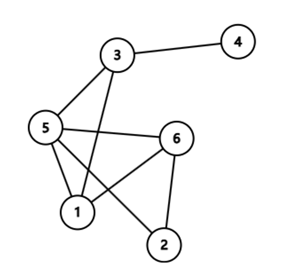

# 图与树的基本概念 

By <CodeforcesUser username="4627488" />

[幻灯片PDF](./slide.pdf)

关键词：图、邻接矩阵、邻接表、树、遍历算法  

## 图的基本概念  

### 定义与组成  

图 $G = (V, E)$，其中 $V$ 是顶点集合，$E$ 是边集合。

- 顶点（Vertex）：图中的节点。
- 边（Edge）：顶点间的连接关系。



#### 图的分类

| 类型   | 特点                             | 例子             |
| ------ | -------------------------------- | ---------------- |
| 无向图 | 边无方向，$(u, v) = (v, u)$      | 社交网络好友关系 |
| 有向图 | 边有方向，$u \to v \neq v \to u$ | 网页超链接关系   |

若 $G$ 的每条边 $e_k=(u_k,v_k)$ 都被赋予一个数作为该边的 **权**，则称 $G$ 为 **赋权图**。如果这些权都是正实数，就称 $G$ 为 **正权图**。

形象地说，图是由若干点以及连接点与点的边构成的。

### 度（Degree）

- 无向图：顶点连接的边数。  

- 有向图：入度（指向顶点的边数）、出度（顶点指向外部的边数）。  

### 路径与环路
  - 途径 (walk)：途径是连接一连串顶点的边的序列，可以为有限或无限长度。
    :::tip 定义 
    形式化地说，一条有限途径 $w$ 是一个边的序列 $e_1, e_2, \ldots, e_k$，使得存在一个顶点序列 $v_0, v_1, \ldots, v_k$ 满足 $e_i = (v_{i-1}, v_i)$，其中 $i \in [1, k]$。这样的途径可以简写为 $v_0 \to v_1 \to v_2 \to \cdots \to v_k$。通常来说，边的数量 $k$ 被称作这条途径的 **长度**（如果边是带权的，长度通常指途径上的边权之和，题目中也可能另有定义）。
    :::
  - 路径（path）：顶点序列 $v_1 \to v_2 \to \dots \to v_k$，相邻顶点间有边。  
  - 简单路径（simple path）：没有重复顶点的路径。  
  - 环路/圈（cycle）：起点和终点相同的路径（如 $v_1 \to v_2 \to v_1$）。 
  - 自环：起点和终点相同的边（如 $(v_1, v_1)$）。
  - 重边：连接同一顶点的多条边（如 $(v_1, v_2)$ 和 $(v_1, v_2)$）。
    :::tip 注意
    在无向图中 $(u, v)$ 和 $(v, u)$ 算一组重边，而在有向图中，$u \to v$ 和 $v \to u$ 不为重边。
    
    在题目中，如果没有特殊说明，是可以存在自环和重边的，在做题时需特殊考虑。
    :::

 
### 连通性
  - 连通图：任意两顶点间存在**路径**（无向图）。  
  - 强连通图：任意两顶点双向可达（有向图）。  

### 子图
#### 无向图
- 定义：$G' = (V', E')$ 是 $G = (V, E)$ 的子图，当且仅当 $V' \subseteq V$ 且 $E' \subseteq E$。
- 若对 $H \subseteq G$，满足 $\forall u, v \in V'$，只要 $(u, v) \in E$，均有 $(u, v) \in E'$，则称 $H$ 是 $G$ 的 **导出子图/诱导子图 (induced subgraph)**。

#### 有向图
- 定义：$G' = (V', E')$ 是 $G = (V, E)$ 的子图，当且仅当 $V' \subseteq V$ 且 $E' \subseteq E$。
- 若对 $H \subseteq G$，满足 $\forall u, v \in V'$，只要 $u \to v \in E$，均有 $u \to v \in E'$，则称 $H$ 是 $G$ 的 **导出子图/诱导子图 (induced subgraph)**。

### 连通

- 无向图：对于一张无向图 $G = (V, E)$，对于 $u, v \in V$，若存在一条途径使得 $v_0 = u, v_k = v$，则称 $u$ 和 $v$ 是 **连通的 (connected)**。由定义，任意一个顶点和自身连通，任意一条边的两个端点连通。
  若一张无向图的节点两两互相连通，则称这张图是 **连通的 (connected)**。

- 有向图：对于一张有向图 $G = (V, E)$，对于 $u, v \in V$，若存在一条途径使得 $v_0 = u, v_k = v$，则称 $u$  **可达**  $v$。由定义，任意一个顶点可达自身，任意一条边的起点可达终点。（无向图中的连通也可以视作双向可达。）
  若一张有向图的节点两两互相可达，则称这张图是 **强连通的 (strongly connected)**。

### 应用场景
- 社交网络：无向图表示用户对称关系。  
- 交通导航：权重图优化最短路径（Dijkstra算法）。  
- 状态机建模：有向图描述系统状态转移（如JK触发器制作模20计数器）。


## 图的存储方式  
### 1. 邻接矩阵  
- 实现方式：  
  - 二维数组 `matrix[u][v]` 表示顶点 $u$ 和 $v$ 的连接关系。  
  - 权重图：`matrix[u][v]` 存储权重值，无边时标记为 $0$ 或 $\infty$。  
- 复杂度分析：  
  | 操作           | 时间复杂度 | 空间复杂度 |
  | -------------- | ---------- | ---------- |
  | 查询边是否存在 | $O(1)$     | $O(V^2)$   |
- 适用场景：稠密图（边数接近顶点数平方）。  

### 2. 邻接表  
- 实现方式：  
  - 每个顶点维护一个链表/数组，存储其所有邻接顶点。  
  - 权重图：存储邻接顶点及权重（如 `(v, weight)`）。  
- 复杂度分析：  
  | 操作               | 时间复杂度         | 空间复杂度 |
  | ------------------ | ------------------ | ---------- |
  | 遍历某顶点的邻接点 | $O(d)$（$d$ 为度） | $O(V + E)$ |
- 适用场景：稀疏图（边数远小于顶点数平方）。  

### 3. 存储方式对比  
| 特性           | 邻接矩阵         | 邻接表             |
| -------------- | ---------------- | ------------------ |
| 空间效率       | 低（稠密图适用） | 高（稀疏图适用）   |
| 查询边效率     | $O(1)$           | $O(d)$             |
| 动态增删边效率 | $O(1)$           | $O(1)$（链表实现） |
| 适用算法       | Floyd-Warshall   | DFS/BFS            |

## 树的基本性质  
### 1. 定义与特性  
- 树是特殊的图：  
  - 连通无环的无向图。  
  - 数学性质：$|E| = |V| - 1$。  
- 森林：由多棵树组成的非连通无环图。  

### 2. 树的结构分类  
- 根树（Rooted Tree）：  
  - 层次结构：根节点、父节点、子节点。  
  - 示例：文件系统目录树。  
- 二叉树（Binary Tree）：  
  - 每个节点最多有两个子节点（左子节点、右子节点）。  
  - 特殊类型：  
    - 满二叉树：所有非叶节点均有2个子节点。  
    - 完全二叉树：除最后一层外，其他层节点全满。  

### 有关树的定义

#### 适用于无根树和有根树

-   **森林（forest）**：每个连通分量（连通块）都是树的图。按照定义，一棵树也是森林。

-   **生成树（spanning tree）**：一个连通无向图的生成子图，同时要求是树。也即在图的边集中选择 $n - 1$ 条，将所有顶点连通。

-   **无根树的叶结点（leaf node）**：度数不超过 $1$ 的结点。（考虑 $n = 1$。）

-   **有根树的叶结点（leaf node）**：没有子结点的结点。

#### 只适用于有根树

-   **父亲（parent node）**：对于除根以外的每个结点，定义为从该结点到根路径上的第二个结点。  
    根结点没有父结点。
-   **祖先（ancestor）**：一个结点到根结点的路径上，除了它本身外的结点。  
    根结点的祖先集合为空。
-   **子结点（child node）**：如果 $u$ 是 $v$ 的父亲，那么 $v$ 是 $u$ 的子结点。  
    子结点的顺序一般不加以区分，二叉树是一个例外。
-   **结点的深度（depth）**：到根结点的路径上的边数。
-   **树的高度（height）**：所有结点的深度的最大值。
-   **兄弟（sibling）**：同一个父亲的多个子结点互为兄弟。
-   **后代（descendant）**：子结点和子结点的后代。或者理解成：如果 $u$ 是 $v$ 的祖先，那么 $v$ 是 $u$ 的后代。

## 树的遍历算法

### 深度优先遍历（DFS）

递归实现模板（以二叉树为例）：
::: code-group
```Python
def dfs(node):  
    if node is None:  
        return  
    # 前序遍历  
    print(node.val)  
    dfs(node.left)  
    dfs(node.right)  
    # 中序：调整print位置  
    # 后序：调整print位置  
```
```C++
void dfs(TreeNode* node) {
    if (node == nullptr) return;
    // 前序遍历
    cout << node->val << endl;
    dfs(node->left);
    dfs(node->right);

    // 中序：调整print位置
    // 后序：调整print位置
}
```
:::

- 应用场景：  
  - 前序：克隆树结构、序列化。  
  - 中序：二叉搜索树（BST）升序输出。  
  - 后序：释放树内存（先处理子节点）。  

### 广度优先遍历（BFS）  
队列辅助实现

::: code-group
```Python
from collections import deque  
def bfs(root):  
    queue = deque([root])  
    while queue:  
        node = queue.popleft()  
        print(node.val)  
        if node.left:  
            queue.append(node.left)  
        if node.right:  
            queue.append(node.right)  
```

```C++
#include <queue>
using namespace std;

void bfs(TreeNode* root) {
    queue<TreeNode*> q;
    q.push(root);
    while (!q.empty()) {
        TreeNode* node = q.front();
        q.pop();
        cout << node->val << endl;
        if (node->left) q.push(node->left);
        if (node->right) q.push(node->right);
    }
}
```
:::

应用场景：最短路径问题、社交网络好友推荐。  

### 遍历结果对比  
| 遍历方式 | 输出顺序（例子：根1，左2，右3） |
| -------- | --------------------------------- |
| 前序     | $1 \to 2 \to 3$                   |
| 中序     | $2 \to 1 \to 3$                   |
| 后序     | $2 \to 3 \to 1$                   |
| 层次     | $1 \to 2 \to 3$                   |

### 一种新的二叉树非递归遍历方法 <Badge text="AtomFirst" type="tip" vertical="middle"/>

[一种新的二叉树非递归遍历方法](https://mp.weixin.qq.com/s/FyInwZApXYkr2FPMZm2QhQ)

:::details 点击查看代码
::: code-group
<<< atomfirst.cpp [原版]

<<< atomfirst2.cpp [导演剪辑版]
:::

#### 递归函数转非递归的一般方法 

1. 找到函数的所有局部变量 $S$（包括参数）
2. 用一个变量 `PC` 表示函数内应执行的下一条语句
3. 使用栈存储 $S$ 和 `PC`
4. 每次根据栈顶信息执行指令，并更新 $S$ 和 `PC` 及进行入栈（函数调用）和出栈（函数结束）操作

## 总结
### 关键知识点  
1. 图与树的关系：树是连通无环图，森林是多棵树。  
2. 存储方式选择：稠密图用邻接矩阵，稀疏图用邻接表。  
3. 树遍历的核心逻辑：DFS递归 / BFS队列。  

### 思考题  
- 如何判断图是否为树？  
  1. 检查是否连通（通过DFS/BFS遍历所有顶点）。  
  2. 验证边数是否满足 $|E| = |V| - 1$。  

## 附录  
### 扩展阅读  
- 《算法导论》第20章：基本图算法
-  <a href="https://mp.weixin.qq.com/s/FyInwZApXYkr2FPMZm2QhQ" style="background: linear-gradient(to right, red, orange, yellow, green, blue, indigo, violet); -webkit-background-clip: text; color: transparent; animation: rainbow 5s infinite linear;">《一种新的二叉树非递归遍历方法》</a>