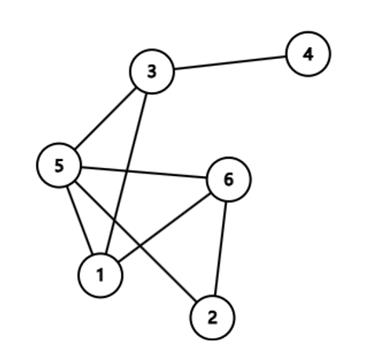

<!-- _class: title -->
# 图与树的基本概念 

4627488
南京航空航天大学

关键词：图、邻接矩阵、邻接表、树、遍历算法  

https://acm.starcstar.club/2025wcamp/day2/

---

# 图的基本概念  

## 定义与组成  

图 $G = (V, E)$，其中 $V$ 是顶点集合，$E$ 是边集合。

- 顶点（Vertex）：图中的节点。
- 边（Edge）：顶点间的连接关系。



---

## 图的分类

| 类型   | 特点                             | 例子             |
| ------ | -------------------------------- | ---------------- |
| 无向图 | 边无方向，$(u, v) = (v, u)$      | 社交网络好友关系 |
| 有向图 | 边有方向，$u \to v \neq v \to u$ | 网页超链接关系   |

若 $G$ 的每条边 $e_k=(u_k,v_k)$ 都被赋予一个数作为该边的 **权**，则称 $G$ 为 **赋权图**。如果这些权都是正实数，就称 $G$ 为 **正权图**。

形象地说，图是由若干点以及连接点与点的边构成的。

---

# 度（Degree）

- 无向图：顶点连接的边数。  

- 有向图：入度（指向顶点的边数）、出度（顶点指向外部的边数）。

---

# 路径与环路（Path & Cycle）
- 途径 (walk)：途径是连接一连串顶点的边的序列，可以为有限或无限长度。
- 路径（path）：顶点序列 $v_1 \to v_2 \to \dots \to v_k$，相邻顶点间有边。  
- 简单路径（simple path）：没有重复顶点的路径。  
- 环路/圈（cycle）：起点和终点相同的路径（如 $v_1 \to v_2 \to v_1$）。 
- 自环：起点和终点相同的边（如 $(v_1, v_1)$）。
- 重边：连接同一顶点的多条边（如 $(v_1, v_2)$ 和 $(v_1, v_2)$）。

> 在无向图中 $(u, v)$ 和 $(v, u)$ 算一组重边，而在有向图中，$u \to v$ 和 $v \to u$ 不为重边。
> 在题目中，如果没有特殊说明，是可以存在自环和重边的，在做题时需特殊考虑。

---
 
# 连通性
  - 连通图：任意两顶点间存在**路径**（无向图）。  
  - 强连通图：任意两顶点双向可达（有向图）。 
  - 连通分量：无向图的极大连通子图（子图后面会讲）。

---

# 子图
#### 无向图
- 定义：$G' = (V', E')$ 是 $G = (V, E)$ 的子图，当且仅当 $V' \subseteq V$ 且 $E' \subseteq E$。
- 若对 $H \subseteq G$，满足 $\forall u, v \in V'$，只要 $(u, v) \in E$，均有 $(u, v) \in E'$，则称 $H$ 是 $G$ 的 **导出子图/诱导子图 (induced subgraph)**。

#### 有向图
- 定义：$G' = (V', E')$ 是 $G = (V, E)$ 的子图，当且仅当 $V' \subseteq V$ 且 $E' \subseteq E$。
- 若对 $H \subseteq G$，满足 $\forall u, v \in V'$，只要 $u \to v \in E$，均有 $u \to v \in E'$，则称 $H$ 是 $G$ 的 **导出子图/诱导子图 (induced subgraph)**。

---

# 图的应用场景
- 社交网络：无向图表示用户对称关系。  
- 交通导航：权重图优化最短路径（Dijkstra算法）。  
- 状态机建模：有向图描述系统状态转移（如JK触发器制作模20计数器）。

---

# 图的存储方式  
## 1. 邻接矩阵  
- 实现方式：  
  - 二维数组 `matrix[u][v]` 表示顶点 $u$ 和 $v$ 的连接关系。  
  - 权重图：`matrix[u][v]` 存储权重值，无边时标记为 $0$ 或 $\infty$。  
- 复杂度分析：  
  | 操作           | 时间复杂度 | 空间复杂度 |
  | -------------- | ---------- | ---------- |
  | 查询边是否存在 | $O(1)$     | $O(V^2)$   |
- 适用场景：稠密图（边数接近顶点数平方）。  

---

## 2. 邻接表  
- 实现方式：  
  - 每个顶点维护一个链表/数组，存储其所有邻接顶点。  
  - 权重图：存储邻接顶点及权重（如 `(v, weight)`）。  
- 复杂度分析：  
  | 操作               | 时间复杂度         | 空间复杂度 |
  | ------------------ | ------------------ | ---------- |
  | 遍历某顶点的邻接点 | $O(d)$（$d$ 为度） | $O(V + E)$ |
- 适用场景：稀疏图（边数远小于顶点数平方）。  

---

# 存储方式对比  
| 特性           | 邻接矩阵         | 邻接表             |
| -------------- | ---------------- | ------------------ |
| 空间效率       | 低（稠密图适用） | 高（稀疏图适用）   |
| 查询边效率     | $O(1)$           | $O(d)$             |
| 动态增删边效率 | $O(1)$           | $O(1)$（链表实现） |
| 适用算法       | Floyd-Warshall   | DFS/BFS            |

---

# 树的基本性质  
## 1. 定义与特性  
- 树是特殊的图：  
  - 连通无环的无向图。  
  - 数学性质：$|E| = |V| - 1$。  
- 森林：由多棵树组成的非连通无环图。  

---

## 2. 树的结构分类  
- 根树（Rooted Tree）：  
  - 层次结构：根节点、父节点、子节点。  
  - 示例：文件系统目录树。  
- 二叉树（Binary Tree）：  
  - 每个节点最多有两个子节点（左子节点、右子节点）。  
  - 特殊类型：  
    - 满二叉树：所有非叶节点均有2个子节点。  
    - 完全二叉树：除最后一层外，其他层节点全满。  
---

### 3. 树的术语  
- 深度：根节点到当前节点的路径长度。  
- 高度：当前节点到最深叶节点的路径长度。  
- 叶节点：无子节点的节点。  
- 内部节点：至少有一个子节点的节点。  


---

# 树的遍历算法

### 深度优先遍历（DFS）

递归实现模板（以二叉树为例）：
```C++
void dfs(TreeNode* node) {
    if (node == nullptr) return;
    // 前序遍历
    cout << node->val << endl;
    dfs(node->left);
    dfs(node->right);

    // 中序：调整print位置
    // 后序：调整print位置
}
```

- 应用场景：  
  - 前序：克隆树结构、序列化。  
  - 中序：二叉搜索树（BST）升序输出。  
  - 后序：释放树内存（先处理子节点）。  


---

### 广度优先遍历（BFS）  
队列辅助实现
```C++
#include <queue>
using namespace std;

void bfs(TreeNode* root) {
    queue<TreeNode*> q;
    q.push(root);
    while (!q.empty()) {
        TreeNode* node = q.front();
        q.pop();
        cout << node->val << endl;
        if (node->left) q.push(node->left);
        if (node->right) q.push(node->right);
    }
}
```

应用场景：最短路径问题、社交网络好友推荐。  

---

### 遍历结果对比  
| 遍历方式 | 输出顺序（例子：根1，左2，右3） |
| -------- | --------------------------------- |
| 前序     | $1 \to 2 \to 3$                   |
| 中序     | $2 \to 1 \to 3$                   |
| 后序     | $2 \to 3 \to 1$                   |
| 层次     | $1 \to 2 \to 3$                   |

---

# 一种新的二叉树非递归遍历方法

- https://mp.weixin.qq.com/s/FyInwZApXYkr2FPMZm2QhQ

#### 递归函数转非递归的一般方法 

1. 找到函数的所有局部变量 $S$（包括参数）
2. 用一个变量 `PC` 表示函数内应执行的下一条语句
3. 使用栈存储 $S$ 和 `PC`
4. 每次根据栈顶信息执行指令，并更新 $S$ 和 `PC` 及进行入栈（函数调用）和出栈（函数结束）操作

---

# 总结

1. 图与树的关系：树是连通无环图，森林是多棵树。  
2. 存储方式选择：稠密图用邻接矩阵，稀疏图用邻接表。  
3. 树遍历的核心逻辑：DFS递归 / BFS队列。  

---

# 思考题  
- 如何判断图是否为树？  
  1. 检查是否连通（通过DFS/BFS遍历所有顶点）。  
  2. 验证边数是否满足 $|E| = |V| - 1$。  

---

# 扩展阅读  
- 《算法导论》第20章：基本图算法
- 《算法竞赛进阶指南》第4章：图论算法
- [LeetCode 树专题](https://leetcode-cn.com/tag/tree/)