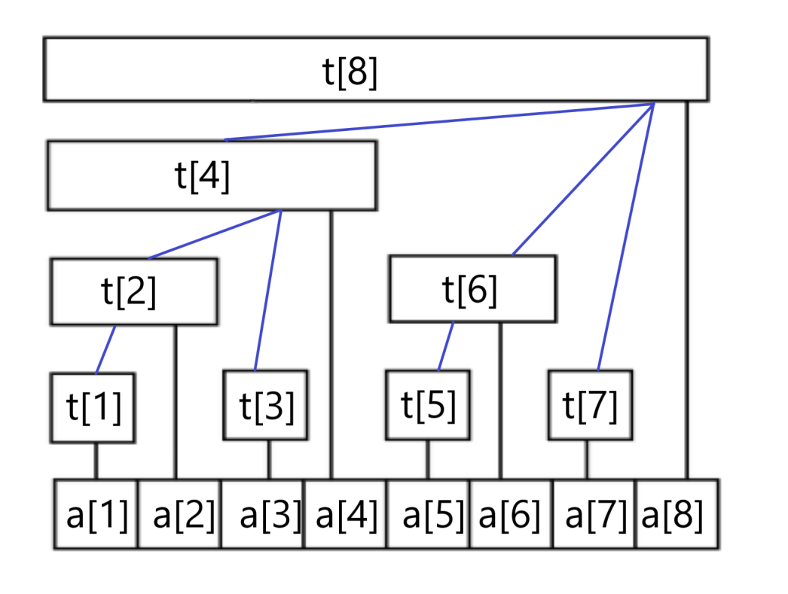
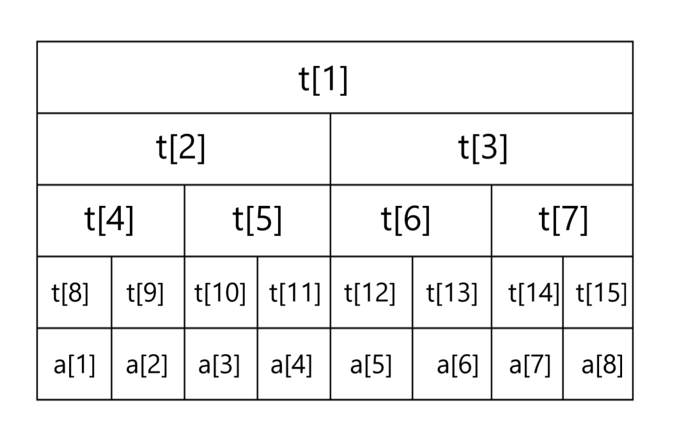

# 区间查询与更新问题

By <CodeforcesUser username="cdd" />

## 树状数组
### 原理

假设现在有一个数组 $a$ ，需要实现在线对其进行**单点修改**和**区间求和**。

朴素的做法是每次遍历求和，每个位置 $x$ 负责的区间为 $[x, x]$ ，求和即为遍历区间每个位置，单次复杂度为 $O(n)$。使用前缀和时，查询虽然是 $O(1)$ ，但每次修改的复杂度仍为 $O(n)$

**树状数组**（又名**二元索引树**，译为 **Binary Indexed Tree** 或 **Fenwick**）

同一层长度相同，与末尾1相关

每一个点管辖的区间就是 $[i - lowbit(i) + 1, i]$



#### lowbit函数

 $lowbit(x)$ 表示 $x$ 在二进制下为 $1$ 的最低位的值，计算方法为 x & -x

> $lowbit(1001_2) = 1_2$
> $lowbit(1001100_2) = 100_2$
> $lowbit(1000_2) = 1000_2$

```cpp
int lowbit(int x) {
	return x & -x;
}
```

### 修改

单点更新就是要修改所有负责区间包含这个位置的值，也就是一层一层向上找到父节点，最多会经过 $logn + 1$ 层，单次修改复杂度 $O(logn)$

```cpp
void add(int pos, int y) {
	for (int i = pos; i <= n; i += lowbit(i))
		t[i] += y;
}
```

### 查询

查询其实是查询这个点的前缀和，需要挨个找到前一个区间进行累加

每个点管辖的区间是 $[i - lowbit(i) + 1, i]$ ，那么前一个区间的右端点就是 $i - lowbit(i)$

```cpp
int query(int pos) {
	int sum = 0;
	for (int i = pos; i; i -= lowbit(i)) 
		sum += t[i];
	return sum;
}
```

查询操作的复杂度取决于二进制位数，单次复杂度为 $O(logn)$

查询区间 $[l, r]$ 的和跟前缀和相等，也就是 $query(r) - query(l - 1)$

### Luogu P3374 【模板】树状数组 1

已知一个数列，你需要进行下面两种操作：

- 将某一个数加上 $x$

- 求出某区间每一个数的和

模板题，按照题意修改查询即可

### Luogu P3368 【模板】树状数组 2

已知一个数列，你需要进行下面两种操作：

- 将某区间每一个数加上 $x$
- 求出某一个数的值。

这里有一个比较经典的思想，区间加法后，区间内的数的相对大小是没有改变的，所以在差分数组上只需要修改第 $l$ 项和第 $r + 1$ 项

令 $v_i = a_i - a_{i - 1}$ ，那么 $a_i = \sum_{i = 1}^{n} v_i$ ，问题就转化为了单点修改和区间查询

### Luogu P1908 逆序对

已知一个长度为 $n$ 的序列，求出该序列中逆序对的个数

\*： 逆序对就是序列中 $a_i>a_j$​ 且 $i < j$ 的有序对

假设选择某一项为 $j$ ，那么可以作为 $i$ 的就是 $j$ 前面所有大于 $a_j$ 的项，就可以用树状数组维护每个数的出现次数，对每一项统计更大的数的个数，再将这个数插入树状数组

PS：这题的 $a_i$ 范围比较大需先进行离散化

```cpp
// mx 为离散化后最大的数的大小
Fenwick t(n);
int ans = 0;
for (int i = 1; i <= n; i++) {
    ans += t.query(a[i] + 1, mx);
    t.add(a[i], 1);
}
```


---

---

## 线段树

### 原理

还是假设现在有一个数组，需要进行 **区间修改** 和 **区间求和**

线段树将每个长度不为 $1$ 的区间划分成左右两个区间递归求解，把整个线段划分为一个树形结构，通过合并左右两区间信息来求得该区间的信息。这种数据结构可以方便的进行大部分的区间操作。

例如现在有一个长度为 $8$ 的数组，划分结构如下：

每一位存储着对应区间的区间和


 
### 建树

每个叶节点的长度为 $1$ ，对应原数组某一位的数，也就是建树时的递归边界

思路就是对于区间 $[l, r]$ ，如果是叶节点，也就是 $l = r$ 时，直接令 $t_p = t_l$ （ $p$ 为该节点在线段树中的序号），否则递归创建 $[l, mid]$ 和 $[mid + 1, r]$，并通过合并两个子区间得到该区间的值

```cpp
void build(int l, int r, int p) {
	if (l == r) return t[p] = a[l], void();
	int mid = (l + r) >> 1;
	build(l, mid, p << 1);
	build(mid + 1, r, p << 1 | 1);
	t[p] = t[p << 1] + t[p << 1 | 1]; // pushup
}
```

### 区间查询

例如要求 $[3, 7]$ 其实就是求 $t[5] + t[6] + t[14]$ ，也就是将区间拆成了 $[3, 4], [5, 6], [7, 7]$

我们通过递归查询，如果当前的区间 $[l, r]$ 完全包含在需要查询的区间内，那么就返回这个区间的值，否则说明还要对当前区间进行拆分，则根据查询范围，返回一个子区间或合并两个子区间得到的结果

```cpp
int query(int l, int r, int x, int y, int p) { // 查询区间为 [x, y]
	if (x <= l && r <= y) { // [l, r] 被 [x, y] 包含
		return t[p];
	}
	int mid = (l + r) >> 1, res = 0;
	if (x <= mid) res += query(l, mid, x, y, p << 1); // 如果查询区间包含左子区间
	if (y > mid) res += query(mid + 1, r, x, y, p << 1 | 1); // 如果查询区间包含右子区间
	return res;
}
```

要查询的区间最多会被拆成 $logn$ 个区间，单次查询复杂度 $O(logn)$

### 区间修改

修改区间 $[l, r]$ 时，可能会想到更新其覆盖的所有节点，但此时需要遍历超过 $r - l + 1$ 个节点，可能导致远超 $log$ 级别。我们引入 **懒惰标记** 来解决这个事情

#### LazyTag

懒惰标记就是将修改信息存放在节点中，当需要访问其子区间时再下放。

进行修改时，我们修改该节点的数值后，将修改值加进该节点的 LazyTag 中，并不更新该区间子节点的信息。当需要访问其子节点时再将标记下放，更新子节点。

```cpp
void pushdown(int l, int r, int p) {
	if (lazy[p]) {
		int ls = p << 1, rs = p << 1 | 1, k = lazy[p];
		int mid = (l + r) >> 1;
		t[ls] += (mid - ls + 1) * k, lazy[ls] += k;
		t[rs] += (rs - mid) * k, lazy[rs] += k;
		lazy[p] = 0;
	}
}
void update(int l, int r, int x, int y, int k, int p) { // 将区间 [x, y] 中的数加上 k
	if (x <= l && r <= y) {
		t[p] += (r - l + 1) * k;
		lazy[p] += k;
		return ;
	}
	pushdown(l, r, mid); // 下放 lazytag
	int mid = (l + r) >> 1;
	if (x <= mid) update(l, mid, x, y, k, p << 1);
	if (y > mid) update(mid + 1, r, x, y, k, p << 1 | 1);
	t[p] = t[p << 1] + t[p << 1 | 1]; // pushup
}
```

那么对应的，查询时也需要将 LazyTag 下放

```cpp
int query(int l, int r, int x, int y, int p) { // 查询区间为 [x, y]
	if (x <= l && r <= y) { // [l, r] 被 [x, y] 包含
		return t[p];
	}
	pushdown(l, r, p);
	int mid = (l + r) >> 1, res = 0;
	if (x <= mid) res += query(l, mid, x, y, p << 1); // 如果查询区间包含左子区间
	if (y > mid) res += query(mid + 1, r, x, y, p << 1 | 1); // 如果查询区间包含右子区间
	return res;
}
```

### 动态开点

若令 $2p$ 和 $2p + 1$ 为左右儿子编号，线段树节点编号最大为 $4n - 5$ ，所以至少将数组长度设置设置为 $4n$

动态开点就是只创建被访问的节点。令开两个数组 $ls$ 和 $rs$ 代表左右儿子的编号，当需要访问的节点不存在时，就新创建一个节点并更新 $ls/rs$ ，最多只需要 $2n - 1$ 个节点

大部分时候使用堆式建树即可，在需要利用线段树的思想实现一些其他功能时，例如 线段树合并 和 可持久化线段树，必须使用动态开点

### Luogu P3372【模板】线段树 1

已知一个数列，你需要进行下面两种操作：

- 将某区间每一个数加上 $x$ 

- 求出某区间每一个数的和

模板题，按照上面的程序即可

### Luogu P3373 【模板】线段树 2

已知一个数列，你需要进行下面三种操作：

- 将某区间每一个数乘上 $x$

- 将某区间每一个数加上 $x$

- 求出某区间每一个数的和

这里包含乘法和加法两个操作，所以需要两个 lazytag

假设目前乘法和加法的 lazytag 分别为 $c_0$ 和 $k_0$

那么子区间的值就是 $t_{ls/rs} \times c_0 + len \times k_0$

进行加法操作后为 $t_{ls/rs} \times c_0 + len \times k_0 + len \times x = t_{ls/rs} \times c_0 + len \times (k_0 + x)$

进行乘法操作后为 $(t_{ls/rs} \times c_0 + len \times k_0) \ times x = t_{ls/rs} \times (c_0 \times x) + len \times (k_0 \times x)$

所以下放 lazytag 时，先对子区间的加法和乘法的 lazytag 均乘上当前点的乘法 lazytag ，再对子区间的加法 lazytag 加上 当前点的加法 lazytag

```cpp
void pushdown(int l, int r, int p) {
	int ls = p << 1, rs = p << 1 | 1, add = lazyadd[p], mul = lazymul[p];
	int mid = (l + r) >> 1, lenl = mid - l + 1, lenr = r - mid;
	lazyadd[ls] = lazyadd[ls] * mul + add, lazymul[ls] *= mul;
	lazyadd[rs] = lazyadd[rs] * mul + add, lazymul[rs] *= mul;
	t[ls] = t[ls] * mul + add * lenl;
	t[rs] = t[rs] * mul + add * lenr;
	lazyadd[p] = 0, lazymul[p] = 1;
}
void updateadd(int l, int r, int x, int y, int k, int p) {
	if (x <= l && r <= y) {
		t[p] += (r - l + 1) * k;
		lazyadd[p] += k;
		return n;
	}
	// ...
}
void updatemul(int l, int r, int x, int y, int k, int p) {
	if (x <= l && r <= y) {
		t[p] *= k;
		lazymul[p] *= k;
		lazyadd[p] *= k;
		return n;
	}
	// ...
}
```

### [USACO11FEB] Generic Cow Protests G

已知一个给定的序列，求有多少种方案，将序列划分若干连续的区间，且每个区间内的和大于等于0

比较经典的利用线段树优化 dp，令 $dp_i$ 表示以 $i$ 为最后一段区间右端点的方案数，朴素的想法是枚举这个区间的左端点 $j$ ，如果 $\sum_{k = j}^{i} a_k > 0$ ，那么对 $dp_i$ 加上 $dp_j$ ，实际上就是要满足 $j < i, s_j < s_i$ 这两个条件，也就是一个顺序对。

所以 $dp_i$ 就是当前线段树中 $[1, s_i - 1]$ 的和，之后在线段树中更新位置 $s_i$ 的值，加上 $dp_i$ 

这题涉及的是单点修改和区间求和，用树状数组也是可以的

```cpp
// s 是对前缀和离散化后得到的序列
update(0, n, s[0], 1, 1); // 线段树范围从 0 开始
for (int i = 1; i <= n; i++) {
	dp[i] = query(0, n, 0, s[i], 1);
	update(0, n, s[i], dp[i], 1);
}
cout << dp[n] << endl;
```

### NF【模板】线段树3？

已知一个数列，你需要进行下面两种操作：

- 修改某个数为 $x$ 

- 求出某区间内的最小值以及最小值的个数

其实不存在这道题，只是我觉得这种线段树比较常用就放上来了

我们用两个数组分别储存最小值 $mn$ 和出现的次数 $cnt$ 

叶节点的最小值就是自己，次数为 $1$

考虑如何合并子区间的信息。当左右区间的最小值不同时，直接使用较小值的信息；当左右区间的最小值相同时，说明在整个区间内出现的次数，就是左区间的次数加上右区间的次数

```cpp
struct node {
	int mn, cnt;
};
void pushup(int l, int r, int p) {
	int ls = p << 1, rs = p << 1 | 1;
	if (t[ls].mn < t[rs].mn) {
		t[p] = t[ls];
	} else if (t[ls].mn > t[rs].mn) {
		t[p] = t[rs];
	} else {
		t[p].mn = t[ls].mn;
		t[p].cnt = t[ls].cnt+ t[rs].cnt;
	}
}
```

从这里也可以看出来，往往只需要更改 pushdown 和 pushup 就可以实现不同的功能

---

---

## 推荐习题

[一个动态更新的洛谷综合题单](https://studyingfather.com/archives/841)

Part 7.7 树状数组和 Part 7.8 线段树

